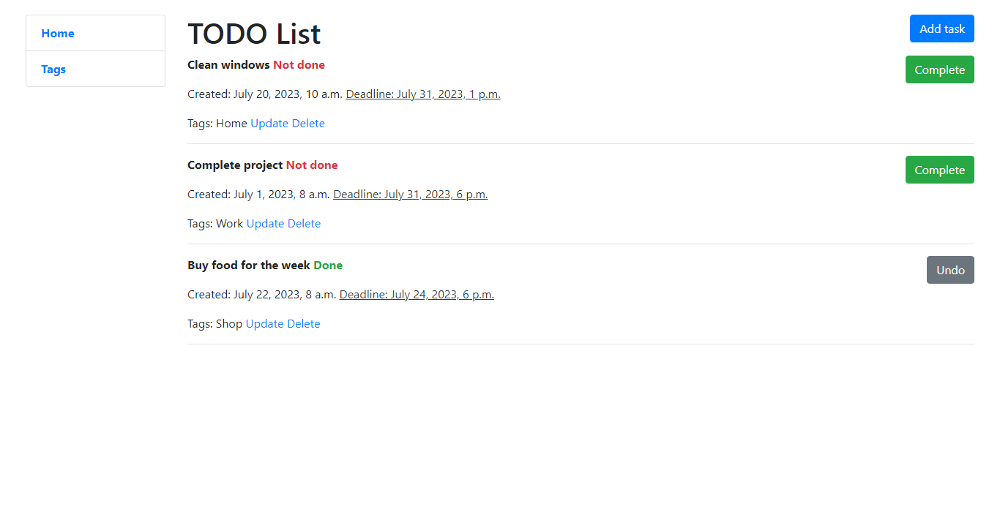

# TODO-List
Django project for organizing tool that helps you see and complete all of your daily tasks. It is a list of things to do.
## Installation
Python3 must be already installed

```shell
git clone https://github.com/svitlana-savikhina/todo-list.git
cd todo-list
python3 -m venv venv
source venv/bin/activate
pip install -r requirements.txt
python manage.py migrate
python manage.py runserver #starts Django Server
```
* Create .env file in root directory.
Write a SECRET_KEY inside .env file (example you can find in .env_sample )

## Demo
